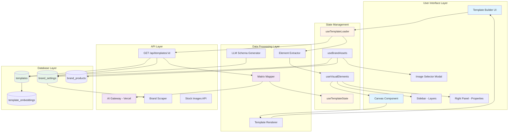
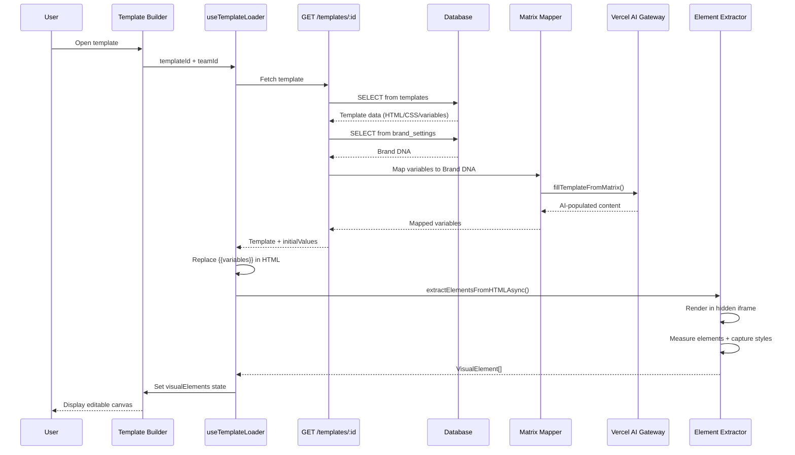
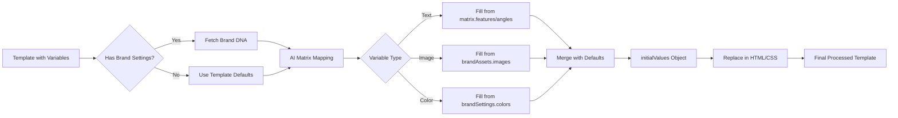
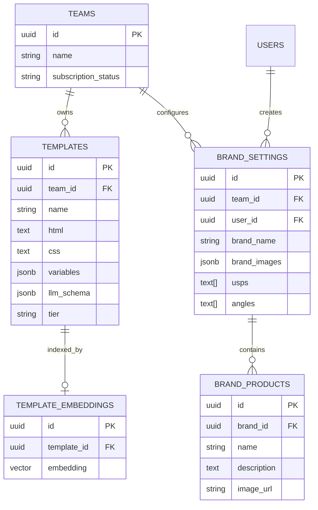
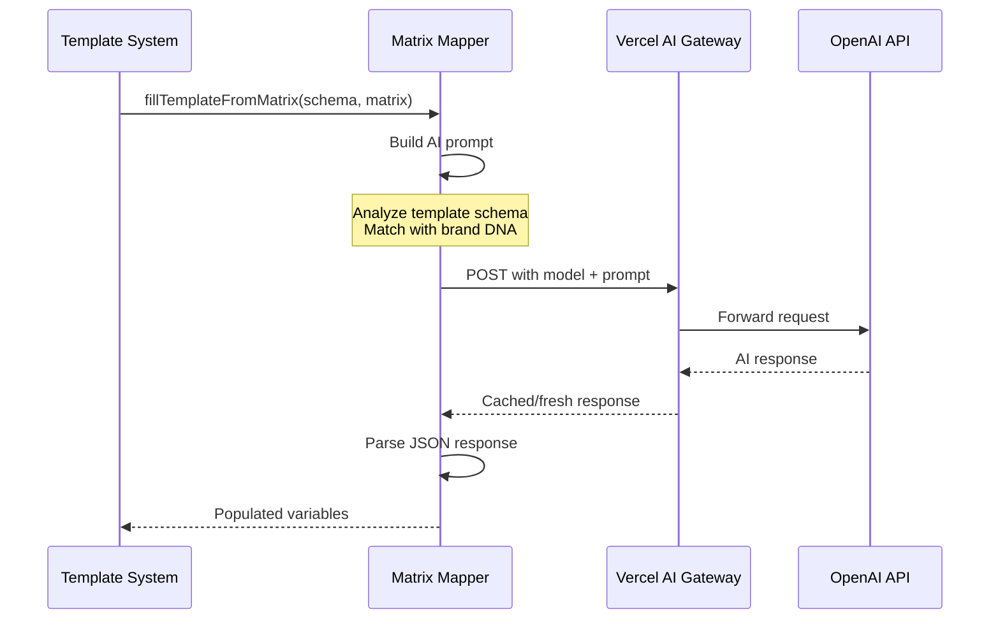

# Template System Architecture Guide

**Version:** 2.0 (JSON-based with HTML/CSS Legacy Support)  
**Last Updated:** December 16, 2025

---

## Table of Contents

1. [System Overview](#system-overview)
2. [Architecture Diagram](#architecture-diagram)
3. [Data Flow](#data-flow)
4. [Component Hierarchy](#component-hierarchy)
5. [Database Schema](#database-schema)
6. [Template Processing Pipeline](#template-processing-pipeline)
7. [Variable System](#variable-system)
8. [AI Integration](#ai-integration)
9. [Key Components Deep Dive](#key-components-deep-dive)

---

## System Overview

The **Viral Loop Engine Template System** is a multi-tenant, AI-powered content template platform that allows users to:

- **Create** visual content templates with dynamic variables
- **Customize** templates with brand-specific data (Brand DNA)
- **Generate** AI-populated content using Vercel AI Gateway
- **Extract** visual elements from HTML/CSS for drag-drop editing
- **Render** final content with brand styling and user inputs

### Key Features

- 🎨 **Visual Builder**: Drag-drop interface for template editing
- 🤖 **AI-Powered**: Automatic content generation from brand data
- 🏢 **Multi-Tenant**: Team-scoped templates and brand settings
- 📦 **Modular Design**: Reusable sections (hero, features, CTA, etc.)
- 🔄 **Variable Mapping**: Intelligent mapping from AI matrix to template slots
- 💾 **Dual Format**: V2 JSON architecture with legacy HTML/CSS fallback

---

## Architecture Diagram



---

## Data Flow

### 1. Template Loading Flow



### 2. Variable Substitution Flow



### 3. Element Extraction Flow

```mermaid
flowchart TB
    Start[HTML/CSS Input] --> CreateIframe[Create Hidden Iframe]
    CreateIframe --> InjectHTML[Inject Processed HTML]
    InjectHTML --> WaitRender[Wait for Rendering]
    
    WaitRender --> QueryElements[Query All Elements]
    QueryElements --> FilterVisible{Element Visible?}
    
    FilterVisible -->|No| Skip[Skip Element]
    FilterVisible -->|Yes| MeasureBounds[Get Bounding Rect]
    
    MeasureBounds --> CaptureStyles[Capture Computed Styles]
    CaptureStyles --> CaptureRawStyle[Store rawStyle Attribute]
    
    CaptureRawStyle --> CheckImage{Is Image?}
    CheckImage -->|Yes| ExtractSrc[Extract src/background-image]
    CheckImage -->|No| ExtractText[Extract textContent]
    
    ExtractSrc --> CreateElement[Create VisualElement Object]
    ExtractText --> CreateElement
    
    CreateElement --> AddToArray[Push to elements[]]
    AddToArray --> MoreElements{More Elements?}
    
    MoreElements -->|Yes| QueryElements
    MoreElements -->|No| CleanupIframe[Remove Iframe]
    
    CleanupIframe --> Return[Return VisualElement[]]
    Skip --> MoreElements
```

---

## Component Hierarchy

```
TemplateBuilder (index.tsx)
├── State Management
│   ├── useTemplateLoader() - Loads template + triggers extraction
│   ├── useTemplateState() - Template metadata state
│   ├── useVisualElements() - Element CRUD operations
│   └── useBrandAssets() - Brand images/products
│
├── Layout Structure
│   ├── Toolbar
│   │   ├── Undo/Redo Buttons
│   │   ├── Save Button
│   │   └── Export Button
│   │
│   ├── Sidebar (Left)
│   │   ├── Layers Tab
│   │   │   └── LayerItem[] (mapped from visualElements)
│   │   └── Templates Tab (future)
│   │
│   ├── Canvas (Center)
│   │   ├── Iframe Preview (during extraction)
│   │   ├── Loader Overlay (isExtracting)
│   │   └── ElementRenderer[] (VisualElement components)
│   │       ├── Drag Handlers (react-dnd)
│   │       ├── Resize Handlers (corners/edges)
│   │       └── Style Application (rawStyle parsing)
│   │
│   └── RightPanel (Right)
│       ├── Properties Tab
│       │   ├── Position Controls (x, y, width, height)
│       │   ├── Style Controls (colors, fonts, etc.)
│       │   └── Content Controls (text, image src)
│       └── Variables Tab
│           └── VariableInput[] (mapped from variableValues)
│
└── Modals
    ├── ImageSelectorModal
    │   ├── Brand Images Tab (NEW)
    │   │   ├── Brand Assets Grid
    │   │   └── Product Images Grid
    │   ├── Stock Images Tab
    │   │   └── Pixabay/Pexels API
    │   └── AI Generation Tab
    │       └── Image Generation Form
    └── FontSelectorModal
        └── Font Picker Interface
```

---

## Database Schema

### Core Tables

```sql
-- Templates Table
CREATE TABLE templates (
  id UUID PRIMARY KEY,
  team_id UUID NOT NULL REFERENCES teams(id),
  name VARCHAR(255) NOT NULL,
  description TEXT,
  html TEXT, -- Legacy HTML/CSS template
  css TEXT,
  variables JSONB, -- {key: {type, label, default, placeholder}}
  llm_schema JSONB, -- Minified schema for AI token efficiency
  category VARCHAR(50),
  tier VARCHAR(20), -- 'free' | 'pro' | 'master'
  tags TEXT[],
  thumbnail_url TEXT,
  created_at TIMESTAMP DEFAULT NOW(),
  updated_at TIMESTAMP DEFAULT NOW()
);

-- Brand Settings Table
CREATE TABLE brand_settings (
  id UUID PRIMARY KEY,
  team_id UUID NOT NULL REFERENCES teams(id),
  user_id UUID NOT NULL REFERENCES users(id),
  
  -- Brand Identity
  brand_name VARCHAR(255),
  brand_description TEXT,
  brand_logo TEXT, -- URL
  brand_url TEXT,
  
  -- Visual Identity
  primary_color VARCHAR(7), -- hex color
  secondary_color VARCHAR(7),
  accent_color VARCHAR(7),
  font_heading VARCHAR(100),
  font_body VARCHAR(100),
  
  -- Strategic DNA (AI-generated)
  archetype VARCHAR(100), -- 'Innovator', 'Caregiver', etc.
  tone_of_voice JSONB, -- {primary, secondary, avoid}
  brand_values TEXT[],
  usps TEXT[], -- Unique Selling Points
  angles TEXT[], -- Content angles
  
  -- Assets
  brand_images JSONB, -- [{url, alt, category}]
  
  created_at TIMESTAMP DEFAULT NOW(),
  updated_at TIMESTAMP DEFAULT NOW()
);

-- Brand Products Table
CREATE TABLE brand_products (
  id UUID PRIMARY KEY,
  brand_id UUID NOT NULL REFERENCES brand_settings(id),
  name VARCHAR(255),
  description TEXT,
  price DECIMAL(10, 2),
  image_url TEXT,
  category VARCHAR(100),
  features TEXT[],
  created_at TIMESTAMP DEFAULT NOW()
);

-- Template Embeddings Table (for AI search)
CREATE TABLE template_embeddings (
  id UUID PRIMARY KEY,
  template_id UUID NOT NULL REFERENCES templates(id),
  embedding VECTOR(1536), -- OpenAI embedding dimension
  created_at TIMESTAMP DEFAULT NOW()
);
```

### Relationships



---

## Template Processing Pipeline

### Stage 1: Template Creation (Seed Scripts)

```typescript
// scripts/seed-templates.ts

const heroTemplate = buildTemplateFromSections([
  SECTIONS.hero({ variant: 'gradient' }),
  SECTIONS.features({ count: 3 }),
  SECTIONS.cta({ style: 'modern' })
]);

// Extract variables from HTML
const variables = extractVariablesFromHTML(heroTemplate.html);

// Generate LLM schema (minified JSON for AI)
const llmSchema = generateLlmSchema(variables);

// Insert into database
await db.insert(templates).values({
  name: 'Hero Template Pro',
  html: heroTemplate.html,
  css: heroTemplate.css,
  variables, // Full schema for UI
  llmSchema, // Minified schema for AI
  tier: 'pro'
});
```

### Stage 2: Template Loading (Runtime)

```typescript
// app/(dashboard)/templates/actions.ts

export const getTemplateWithMatrixAction = async (templateId: string) => {
  // 1. Fetch template from DB
  const template = await db.query.templates.findFirst({
    where: eq(templates.id, templateId)
  });
  
  // 2. Fetch brand settings
  const brandSettings = await db.query.brandSettings.findFirst({
    where: eq(brandSettings.teamId, teamId)
  });
  
  // 3. If no brand, return template with defaults
  if (!brandSettings) {
    return { template, initialValues: extractDefaults(template.variables) };
  }
  
  // 4. Build content matrix from brand DNA
  const matrix = buildContentMatrix(brandSettings);
  
  // 5. Map template variables to matrix using AI
  const mappedVariables = await fillTemplateFromMatrix(
    template.llmSchema,
    matrix
  );
  
  // 6. Merge with original defaults (preserve all keys)
  const initialValues = { ...extractDefaults(template.variables), ...mappedVariables };
  
  return { template, initialValues, brandSettings };
};
```

### Stage 3: Variable Substitution

```typescript
// components/custom/TemplateBuilder/hooks/useTemplateLoader.ts

const processedHtml = useMemo(() => {
  let result = template.html;
  
  // Replace all {{variables}} with values from initialValues
  Object.entries(initialValues).forEach(([key, value]) => {
    const regex = new RegExp(`{{${key}}}`, 'g');
    result = result.replace(regex, String(value));
  });
  
  return result;
}, [template.html, initialValues]);
```

### Stage 4: Element Extraction

```typescript
// components/custom/TemplateBuilder/utils/extractElements.ts

export async function extractElementsFromHTMLAsync(
  html: string,
  css: string
): Promise<VisualElement[]> {
  return new Promise((resolve) => {
    // Create hidden iframe
    const iframe = document.createElement('iframe');
    iframe.style.cssText = 'position:absolute;width:1920px;height:1080px;visibility:hidden;';
    document.body.appendChild(iframe);
    
    const doc = iframe.contentDocument!;
    doc.write(`
      <style>${css}</style>
      <div>${html}</div>
    `);
    
    setTimeout(() => {
      const elements: VisualElement[] = [];
      const allElements = doc.querySelectorAll('*');
      
      allElements.forEach((el) => {
        const rect = el.getBoundingClientRect();
        const computed = window.getComputedStyle(el);
        
        // Skip invisible or zero-size elements
        if (rect.width === 0 || rect.height === 0) return;
        
        elements.push({
          id: generateId(),
          type: el.tagName.toLowerCase(),
          x: rect.left,
          y: rect.top,
          width: rect.width,
          height: rect.height,
          text: el.textContent || '',
          rawStyle: el.getAttribute('style') || '', // Preserve inline styles
          // ... extract other properties
        });
      });
      
      document.body.removeChild(iframe);
      resolve(elements);
    }, 300);
  });
}
```

### Stage 5: Canvas Rendering

```typescript
// components/custom/TemplateBuilder/components/Canvas.tsx

const parseInlineStyle = (rawStyle: string | undefined): React.CSSProperties => {
  if (!rawStyle) return {};
  
  const styleObj: any = {};
  rawStyle.split(';').forEach((rule) => {
    const [key, value] = rule.split(':').map(s => s.trim());
    if (key && value) {
      const camelKey = key.replace(/-([a-z])/g, (g) => g[1].toUpperCase());
      styleObj[camelKey] = value;
    }
  });
  
  return styleObj;
};

// Render each element
{visualElements.map((el) => (
  <div
    key={el.id}
    style={{
      ...parseInlineStyle(el.rawStyle), // Apply inline styles first
      position: 'absolute',
      left: el.x,
      top: el.y,
      width: el.width,
      height: el.height,
      // ... other computed styles
    }}
  >
    {el.type === 'img' ? (
      
    ) : (
      el.text
    )}
  </div>
))}
```

---

## Variable System

### Variable Schema Structure

```typescript
interface TemplateVariable {
  type: 'text' | 'image' | 'color' | 'url';
  label: string; // Human-readable name for UI
  default: string; // Fallback value
  placeholder?: string; // UI hint
  category?: string; // For grouping in UI
}

// Example from template:
const variables = {
  heroTitle: {
    type: 'text',
    label: 'Hero Title',
    default: 'Welcome to Our Platform',
    placeholder: 'Enter compelling headline...'
  },
  heroImage: {
    type: 'image',
    label: 'Hero Background',
    default: 'https://placehold.co/1920x1080',
  },
  primaryColor: {
    type: 'color',
    label: 'Primary Brand Color',
    default: '#3B82F6'
  }
};
```

### Variable Mapping (AI-Powered)

```typescript
// lib/templates/matrix-mapper.ts

export async function fillTemplateFromMatrix(
  schema: Record<string, TemplateVariable>,
  matrix: ContentMatrix
): Promise<Record<string, string>> {
  const result: Record<string, string> = {};
  
  for (const [key, config] of Object.entries(schema)) {
    if (config.type === 'text') {
      // Smart mapping based on key name
      if (key.includes('title') || key.includes('headline')) {
        result[key] = matrix.features?.[0]?.title || config.default;
      } else if (key.includes('description')) {
        result[key] = matrix.features?.[0]?.description || config.default;
      } else if (key.includes('cta')) {
        result[key] = matrix.angles?.[0] || config.default;
      } else {
        // Fallback: use default or pick from matrix
        result[key] = config.default || matrix.features?.[0]?.title || 'Content';
      }
    } else if (config.type === 'image') {
      result[key] = matrix.brandAssets?.images?.[0]?.url || config.default;
    } else if (config.type === 'color') {
      result[key] = matrix.brandSettings?.primaryColor || config.default;
    }
  }
  
  return result;
}
```

### Variable Usage in Templates

```html
<!-- Template HTML with variables -->
<div class="hero" style="background-image: url({{heroImage}});">
  <h1 style="color: {{primaryColor}};">{{heroTitle}}</h1>
  <p>{{heroSubtitle}}</p>
  <a href="{{ctaUrl}}" class="btn">{{ctaText}}</a>
</div>

<!-- After substitution -->
<div class="hero" style="background-image: url(https://cdn.brand.com/hero.jpg);">
  <h1 style="color: #3B82F6;">Transform Your Business</h1>
  <p>AI-powered content platform for modern teams</p>
  <a href="https://brand.com/signup" class="btn">Start Free Trial</a>
</div>
```

---

## AI Integration

### Vercel AI Gateway Flow



### AI Configuration

```env
# .env
AI_GATEWAY_API_KEY=vck_xxx  # Vercel AI Gateway token
AI_MODEL_CHAT=gpt-4o-mini   # Fast model for high-volume
AI_MODEL_SMART=gpt-4o       # Advanced model for complex tasks
AI_ENABLED=true
AI_MAX_TOKENS=4096
AI_TEMPERATURE=0.7
```

### AI Usage Example

```typescript
// lib/ai/gateway.ts
import { createOpenAI } from '@ai-sdk/openai';

const openai = createOpenAI({
  apiKey: process.env.AI_GATEWAY_API_KEY,
  baseURL: 'https://gateway.ai.vercel.com/openai/v1', // AI Gateway endpoint
});

export const getModel = (type: 'fast' | 'smart' = 'fast') => {
  return openai(type === 'fast' ? 'gpt-4o-mini' : 'gpt-4o');
};

// Usage in matrix mapper
const result = await generateText({
  model: getModel('fast'),
  prompt: `Analyze this template schema and fill with brand data...`,
  temperature: 0.7,
  maxTokens: 2000,
});
```

---

## Key Components Deep Dive

### 1. TemplateBuilder (Main Container)

**File:** `components/custom/TemplateBuilder/index.tsx`

**Responsibilities:**
- Orchestrate all sub-components
- Manage global state (template, elements, brand assets)
- Handle loading/extraction lifecycle
- Coordinate save/export operations

**Key State:**
```typescript
const [template, setTemplate] = useState<Template | null>(null);
const [visualElements, setVisualElements] = useState<VisualElement[]>([]);
const [variableValues, setVariableValues] = useState<Record<string, any>>({});
const [isExtracting, setIsExtracting] = useState(false);
const [brandAssets, setBrandAssets] = useState<BrandAssets | null>(null);
```

### 2. useTemplateLoader Hook

**File:** `components/custom/TemplateBuilder/hooks/useTemplateLoader.ts`

**Purpose:** Load template from API, process variables, trigger extraction

**Flow:**
```typescript
useEffect(() => {
  if (!templateId) return;
  
  const load = async () => {
    setIsExtracting(true);
    
    // 1. Fetch template + brand data
    const data = await getTemplateWithMatrixAction(templateId);
    
    // 2. Set initial values (AI-populated)
    setVariableValues(data.initialValues);
    
    // 3. Replace variables in HTML
    let processedHtml = data.template.html;
    Object.entries(data.initialValues).forEach(([key, value]) => {
      processedHtml = processedHtml.replace(new RegExp(`{{${key}}}`, 'g'), value);
    });
    
    // 4. Extract visual elements
    const elements = await extractElementsFromHTMLAsync(
      processedHtml,
      data.template.css
    );
    
    setVisualElements(elements);
    setIsExtracting(false);
  };
  
  load();
}, [templateId]);
```

### 3. Canvas Component

**File:** `components/custom/TemplateBuilder/components/Canvas.tsx`

**Purpose:** Render editable visual elements with drag/resize

**Key Features:**
- Iframe preview during extraction (with loader overlay)
- Drag-drop repositioning (react-dnd)
- Corner/edge resize handles
- Real-time style application from `rawStyle`
- Click-to-select elements

**Rendering Logic:**
```typescript
{isExtracting ? (
  <div className="relative w-full h-full">
    <iframe ref={iframeRef} className="w-full h-full" />
    <div className="absolute inset-0 bg-white/80 backdrop-blur-sm flex items-center justify-center">
      <Loader className="animate-spin" />
      <p>Extraction des éléments...</p>
    </div>
  </div>
) : (
  <div className="relative w-full h-full">
    {visualElements.map((el) => (
      <DraggableElement
        key={el.id}
        element={el}
        onUpdate={updateElement}
        style={{
          ...parseInlineStyle(el.rawStyle),
          position: 'absolute',
          left: el.x,
          top: el.y,
          width: el.width,
          height: el.height,
        }}
      />
    ))}
  </div>
)}
```

### 4. ImageSelectorModal

**File:** `components/custom/TemplateBuilder/components/ImageSelectorModal.tsx`

**Purpose:** Multi-source image selection (Brand, Stock, AI)

**Tabs:**
1. **Mes Images** (Brand Tab) - NEW
   - Brand logo
   - Product images
   - Uploaded brand assets
   
2. **Banque d'images** (Stock Tab)
   - Pixabay API integration
   - Pexels API integration
   - Search + filter by type
   
3. **Génération IA** (AI Tab)
   - Text-to-image generation
   - DALL-E/Stable Diffusion integration

**Usage:**
```typescript
<ImageSelectorModal
  open={showImageSelector}
  onOpenChange={setShowImageSelector}
  activeImageVariable={activeImageVariable}
  variableValues={variableValues}
  setVariableValues={setVariableValues}
  brandAssets={brandAssets} // NEW: Pass brand images
  updateElement={updateElement}
  saveToHistory={saveToHistory}
/>
```

### 5. Matrix Mapper

**File:** `lib/templates/matrix-mapper.ts`

**Purpose:** Intelligent mapping of template variables to brand content

**Algorithm:**
1. Analyze template schema (variable names, types, defaults)
2. Build content matrix from brand DNA (USPs, angles, features)
3. Match variables to appropriate matrix values
4. Fallback to schema defaults if no match
5. Return complete key-value map

**Smart Matching:**
- `heroTitle` → `matrix.features[0].title`
- `heroImage` → `matrix.brandAssets.images[0].url`
- `ctaText` → `matrix.angles[0]`
- `primaryColor` → `matrix.brandSettings.primaryColor`
- Unknown keys → `schema.default` or `'Content'`

---

## Performance Optimizations

### 1. Token Efficiency
- **LLM Schema**: Minified JSON sent to AI (99% token reduction vs full HTML)
- **Caching**: Vercel AI Gateway caches repeated prompts
- **Model Selection**: Use `gpt-4o-mini` for high-volume tasks

### 2. Extraction Speed
- **Parallel Processing**: Extract all elements in single iframe render
- **Visibility Checks**: Skip hidden/zero-size elements early
- **Debounced Updates**: Batch element updates during drag/resize

### 3. State Management
- **React Hooks**: Avoid prop drilling with custom hooks
- **Memoization**: `useMemo` for expensive computations (variable replacement)
- **Lazy Loading**: Load brand assets only when needed

---

## Error Handling

### Template Not Found
```typescript
if (!template) {
  return <ErrorState message="Template not found" />;
}
```

### No Brand Settings
```typescript
if (!brandSettings) {
  // Use template defaults instead
  const initialValues = extractDefaults(template.variables);
  return { template, initialValues };
}
```

### Extraction Failure
```typescript
try {
  const elements = await extractElementsFromHTMLAsync(html, css);
  setVisualElements(elements);
} catch (error) {
  console.error('Extraction failed:', error);
  toast.error('Failed to extract template elements');
  setIsExtracting(false);
}
```

### AI Gateway Errors
```typescript
try {
  const result = await generateText({ model, prompt });
  return result.text;
} catch (error) {
  if (error.code === 'GATEWAY_INTERNAL_SERVER_ERROR') {
    // Credit card required
    return fallbackDefaults;
  }
  throw error;
}
```

---

## Future Enhancements

### Planned Features
- [ ] Real-time collaboration (multiple users editing same template)
- [ ] Version history with diff viewer
- [ ] Template marketplace (buy/sell templates)
- [ ] Advanced AI: context-aware smart suggestions
- [ ] Export to multiple formats (React, Vue, HTML, PDF)
- [ ] Mobile responsive preview modes
- [ ] Animation timeline editor
- [ ] Component library (reusable sections)

### Technical Debt
- [ ] Add comprehensive test suite (Jest + React Testing Library)
- [ ] Implement proper error boundaries
- [ ] Add Sentry for production error tracking
- [ ] Optimize bundle size (code splitting)
- [ ] Add rate limiting to API routes
- [ ] Implement WebSocket for real-time updates

---

## Debugging Guide

### Common Issues

**1. Variables disappearing after extraction**
- **Cause:** `fillTemplateFromMatrix` dropping keys without fallback
- **Fix:** Always merge with original defaults: `{ ...defaults, ...mapped }`

**2. CSS styles not applying (CRITICAL - Images losing border-radius, etc.)**
- **Cause:** Inline styles not captured from original HTML OR not being applied during rendering
- **Root Issue:** The extraction process captures `rawStyle` attribute, but Canvas rendering must apply it
- **Symptoms:** 
  - Images showing briefly as circles then becoming squares
  - Background gradients disappearing
  - Border styles vanishing after a few milliseconds
  - `backdrop-filter` effects not working
- **Fix Chain:**
  1. **Extraction** (`utils/extractElements.ts`):
     - Line ~192: `const rawStyle = el.getAttribute('style') || '';` ✅ ALREADY IMPLEMENTED
     - Captures inline CSS like `border-radius:50%; border:10px solid white;`
  
  2. **Storage** (`types/index.ts`):
     - Add `rawStyle?: string;` to `VisualElement` interface ✅ ALREADY IMPLEMENTED
     - Also add specific props: `borderRadius`, `backdropFilter`, `backgroundSize`, `backgroundPosition`
  
  3. **Rendering** (`components/Canvas.tsx`):
     - **TEXT ELEMENTS** (Line ~331): 
       ```tsx
       style={{
         ...parseInlineStyle(el.rawStyle), // Apply first (base styles)
         color: el.color,
         fontSize: el.fontSize,
         // ... other extracted properties override if present
       }}
       ```
     - **IMAGE ELEMENTS** (Line ~381): 
       ```tsx
       <div style={{
         ...parseInlineStyle(el.rawStyle), // Apply to wrapper
         borderRadius: el.borderRadius || 0,
         overflow: 'hidden',
       }}>
         
       </div>
       ```
     - **RECTANGLES/CIRCLES** (Line ~437):
       ```tsx
       style={{
         ...parseInlineStyle(el.rawStyle), // Apply first
         backgroundColor: el.backgroundColor,
         // ... other extracted properties
       }}
       ```
  
  4. **Helper Function** (`parseInlineStyle`):
     - Line ~7-24 in Canvas.tsx
     - Converts CSS string like `border-radius:50%;border:10px solid white;` to React object
     - **CRITICAL**: Must convert kebab-case to camelCase (`border-radius` → `borderRadius`)
     ```tsx
     function parseInlineStyle(styleString?: string): React.CSSProperties {
       if (!styleString) return {};
       const styles: Record<string, string> = {};
       styleString.split(';').forEach(decl => {
         const [property, value] = decl.split(':').map(s => s.trim());
         if (property && value) {
           // Convert kebab-case to camelCase
           const camelProp = property.replace(/-([a-z])/g, (g) => g[1].toUpperCase());
           styles[camelProp] = value;
         }
       });
       return styles as React.CSSProperties;
     }
     ```
- **Testing:** Load template `pro-feature-heavy-promo` which uses `product-feature-list` section
  - Section HTML has: ``
  - After extraction: `visualElement.rawStyle` should contain full style string
  - After rendering: Image should maintain circular shape and white border
  - **Common Mistake:** Only applying `rawStyle` to wrapper div but not the `` tag itself

**3. Elements not showing in layers**
- **Cause:** Zero-size elements or strict visibility checks
- **Fix:** Inject placeholder SVG for `{{variable}}` images, relax checks

**4. Template not loading**
- **Cause:** Fetching template after checking brand settings
- **Fix:** Always fetch template first, handle no-brand case separately

**5. CSS Preload Warning in Console**
- **Message:** `Preload of http://localhost:3000/_next/static/chunks/[...].css was ignored due to unknown "as" or "type" values`
- **Impact:** Usually harmless - Next.js tries to preload CSS that browser doesn't recognize
- **Fix:** Not required - doesn't affect template rendering
- **Alternative:** If persistent, check Next.js config for experimental CSS features

### Debug Tools

```typescript
// Enable detailed logging
localStorage.setItem('DEBUG_TEMPLATE_SYSTEM', 'true');

// Check extraction state
console.log('isExtracting:', isExtracting);
console.log('visualElements:', visualElements);

// Inspect variable substitution
console.log('initialValues:', initialValues);
console.log('variableValues:', variableValues);

// Monitor AI Gateway
console.log('AI_ENABLED:', process.env.AI_ENABLED);
console.log('AI_MODEL:', process.env.AI_MODEL_CHAT);

// Debug rawStyle preservation (add to extractElements.ts)
console.log('Element rawStyle:', {
  id: visualElement.id,
  rawStyle: el.getAttribute('style'),
  computed: {
    borderRadius: computedStyle.borderRadius,
    border: computedStyle.border,
  }
});

// Debug Canvas rendering (add to Canvas.tsx)
console.log('Rendering element:', {
  id: el.id,
  type: el.type,
  rawStyle: el.rawStyle,
  parsedStyle: parseInlineStyle(el.rawStyle),
  borderRadius: el.borderRadius,
});
```

### Template-Specific Debugging: "Feature Heavy Promo"

**Template ID:** `pro-feature-heavy-promo`  
**Sections Used:**
1. `overlay-dark-gradient` (background)
2. `header-modern-nav` (top navigation)
3. `product-feature-list` (main content - circular image with features)
4. `footer-bold-cta` (call to action)

**Known Issue:** Image in `product-feature-list` loses `border-radius:50%` after extraction

**Debugging Steps:**
1. **Check Section HTML** (`lib/builder/library.ts` line ~56):
   ```html
   
   ```
   - ✅ Inline styles present in source

2. **Check Extraction** (Add console.log in `utils/extractElements.ts`):
   ```typescript
   if (isImage) {
     console.log('📷 Extracting image:', {
       rawStyle: el.getAttribute('style'),
       computedBorderRadius: computedStyle.borderRadius,
       rect: { width: rect.width, height: rect.height }
     });
   }
   ```
   - Expected: `rawStyle` = `"width:300px;height:300px;object-fit:cover;border-radius:50%;border:10px solid rgba(255,255,255,0.2)"`
   - Expected: `computedBorderRadius` = `"150px"` (50% of 300px)
   - ⚠️ If missing: Check `rawStyle = el.getAttribute('style')` line

3. **Check VisualElement Object**:
   ```typescript
   console.log('Visual element created:', {
     id,
     type,
     rawStyle,
     borderRadius: parseFloat(computedStyle.borderRadius),
   });
   ```
   - Expected: `rawStyle` string preserved
   - Expected: `borderRadius` = 150

4. **Check Canvas Rendering** (Add console.log in `Canvas.tsx`):
   ```typescript
   {el.type === 'image' && (
     console.log('Rendering image:', {
       id: el.id,
       rawStyle: el.rawStyle,
       parsedStyle: parseInlineStyle(el.rawStyle),
       borderRadius: el.borderRadius,
     }),
     
   )}
   ```
   - Expected: `parsedStyle` = `{ width: '300px', borderRadius: '50%', border: '10px solid rgba(255,255,255,0.2)' }`
   - ⚠️ If `parsedStyle` is empty: Check `parseInlineStyle` function
   - ⚠️ If styles not visible: Check that `...parseInlineStyle()` is spread FIRST in style object

5. **Visual Inspection**:
   - Load template in editor
   - Check iframe preview (should show circle)
   - Wait for extraction (loader appears)
   - Check rendered elements (should still be circle)
   - If square: CSS lost between extraction and rendering
   - Use browser DevTools → Inspect image → Check computed styles

**Root Cause (If Still Failing):**
- Most likely: `parseInlineStyle(el.rawStyle)` NOT applied to `` tag
- Alternative: `rawStyle` not captured during extraction
- Rare: React re-render causing style loss (check `useMemo` dependencies)


---

## Conclusion

The **Viral Loop Engine Template System** is a sophisticated, multi-layered architecture that combines:

- **Modern React patterns** (hooks, server components)
- **AI-powered content generation** (Vercel AI Gateway)
- **Visual editing capabilities** (drag-drop, real-time preview)
- **Multi-tenant isolation** (team-scoped data)
- **Brand intelligence** (DNA extraction, smart mapping)

This document serves as the **source of truth** for understanding how all pieces fit together. For specific implementation details, refer to the individual component files and inline code comments.

---

**Questions?** Check the codebase comments or ask the development team!
